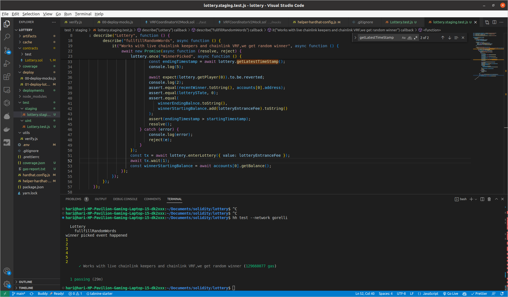
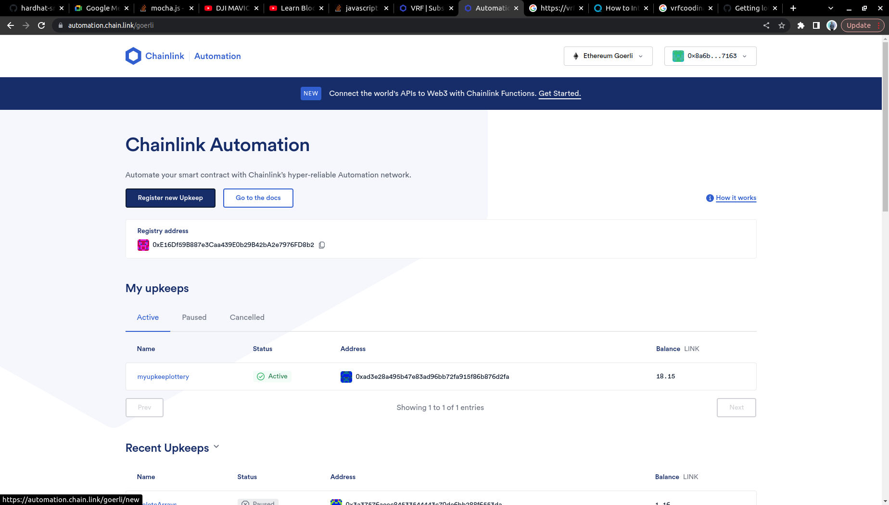

# Lottery Contract (with Verifiable Random Function and Automation)

## Description

This contract can be used to setup a lottery contract that will select the winner in a verifiable random way and automatically funds the winner with the ETH and
resets itself once few players enters the lottery.

## Technologies Used

-   [ChainLink VRF](https://docs.chain.link/vrf/v2/introduction/)
-   [Chainlink Keepers](https://docs.chain.link/chainlink-automation/introduction/)
-   [hardhat](https://hardhat.org/docs)
-   [hardhat-testing](https://hardhat.org/hardhat-runner/docs/guides/test-contracts)
-   [solidity-coverage](https://www.npmjs.com/package/solidity-coverage)

## Quick Start

-   create .env file with GORELLI_RPC_URL, PRIVATE_KEY, ETHERSCAN_API_KEY, COIN_MARKET_CAP_API_KEY, POLYGON_API_KEY

-   Install all dependencies

    `yarn install`

-   Compile contract

    `yarn compile`

-   To do unit test cases

    `yarn test`

-   To do staging test

    `yarn test-staging`

    > Note: It will take some time (10 min)

-   before deployment go to [this](https://vrf.chain.link/goerli) or use (this)[https://vrf.chain.link/mumbai] for polygon mumbai and create a subsription and recharge it with LINK tokens as it is used to pay for chainlink vrf

    > Note: Connect the wallet with network polygon-mumbai in Metamask

    -   update [helper-hardhat-config.config](helper-hardhat-config.js) in 5 update subsriptionId to the subsription id you copied or else if you are using polygon-mumbai change 80001 subsriptionId

-   To deploy the contract

    `yarn hardhat deploy --network [polygon_mumbai,goreli]`

-   Once deployed got to [this](https://automation.chain.link/goerli) for registering new upkeep with custom logic or use [this](https://automation.chain.link/mumbai) for polygon-mumbai and register deployed contract address

## Screenshots

-   Staging

    

-   VRF

    

-   Chainlink Automation

    
